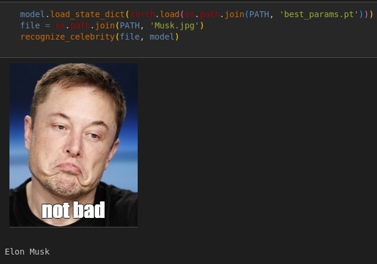

# Project 1. "Guess a Celebrity"
## Image classification, face recognition

### Project description
The training and validation datasets with photos of five well-known persons are provided. The task is to develop a classificator based on a pretrained convolutional neural network for photo recognition.

### The case  
Transfer learning: fine-tuning of a convolutional network pretrained on the ImageNet dataset to implement data classification for own purposes.

**Skillfactory requirements:**  
The data are loaded with DataLoader, a pretrained model is used, the accuracy acc@1 on the validation sample is > 0.85, the results are visualized, the code is concise and understandable, comments are added.

### The data
A dataset with low-resolution photos (primarily $70\times70$ pixels), divided into the training and validation samples in advance. 
The data are provided by Skillfactory and can be downloaded from [Google Drive](https://drive.google.com/file/d/120xqh0mYtYZ1Qh7vr-XFzjPbSKivLJjA/view?usp=sharing). 

### Results
Based on the pretrained EfficientNetV2-s model [(arXiv:2104.00298)](https://arxiv.org/abs/2104.00298), a classificator for face recognition of five well-known persons is developed. The two last blocks of the feature extractor and the exit layer of the CNN classificator have been tuned. An accuracy of 98% has been achieved on the validation. For the correct work of the model, a photo should preferably contain only a face without background (as in the training data). The small size of the training image files and the small size of the model allowed the training (20 epochs) to be performed at a relatively weak GPU (GeForce GTX 1650 with 4 GB memory and 896 CUDA cores) in a time of about 3 min.