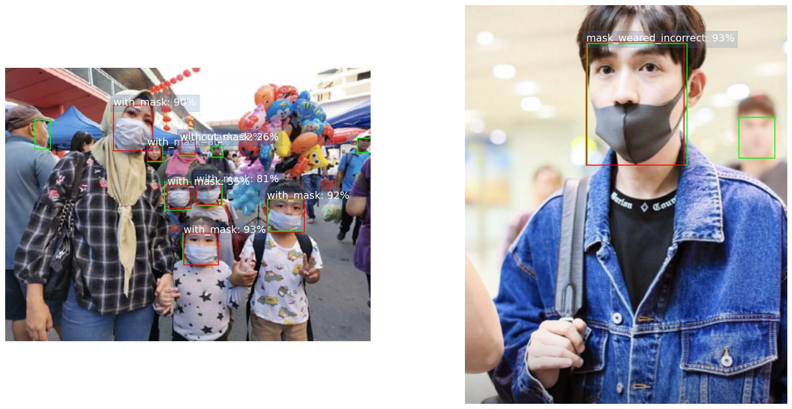

# Project 2. Mask Detection
## Object detection case

### Project description
Object detection problem with transfer learning of the two popular models: Faster R-CNN and YOLOv8. The dataset is hardly imbalanced (3% and 18% for the minor classes against the 79% of the major class). The Jupiter notebook for this project is [available on Kaggle](https://www.kaggle.com/code/dkudryavtsev/mask-detection-faster-r-snn-vs-yolov8).

### The case    

* object detection with Faster R-CNN
* object detection with YOLO version 8
* work with hardly imbalanced data
* calculation of the mAP metric over a dataset
* visualisation of the images with bounding boxes
* visualization of the training process

**Skillfactory requirements:**  
* Data are loaded with a DataLoader
* A pretrained model is used, the choice of the model is explained
* Detectores from the R-CNN and YOLO families are used 
* The training is made with the training sample
* Average precision on the validation sample for the two detectors is > 0.85
* The results are visualized
* The code is readable and understandable, comments are added

### The data
The project is based on the Kaggle [Face Mask Detection](https://www.kaggle.com/datasets/andrewmvd/face-mask-detection) dataset. Three classes are presented: with mask (79%), without mask (18%), mask weared incorrectly (3%).
  
### Results
| Model | No. of parameters | GFLOPS| mAP | minor class AP | mAP50  | One epoch training time |
|---|---|---|---|---|---|---|
| Faster R-CNN | 41.8 mln  | 134 | 0.53  | 0.39 | 0.79  | 2.4 min |
| YOLOv8 | 25.9 mln | 79 | 0.68 | 0.69 | 0.92 | 0.5 min |

Two models from the Faster R-CNN and YOLO families have been trained, and the metrics calculated. The YOLO model is faster, more accurate, and shows better results for underrepresented classes, the worst case is AP50=0.89 for the most poorly represented class, while for all the classes mAP50=0.92, and AP50 is almost 0.97 for the major class.

Faster R-CNN is usually considered as a more slow but more accurate model. This case is different. The reason is perhaps in the imbalanced data and the fact that YOLO, since version 7, incorporates the focal loss function, which takes into account class imbalance, and the loss function [is modified for increased accuracy](https://encord.com/blog/yolo-object-detection-guide/) in version 8. Apparently, this approach works better than the weighted loading implemented here for Faster R-CNN.