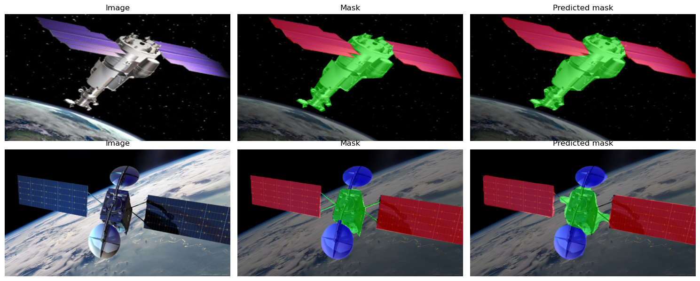

# Project 3. Spacecraft Component Segmentation
## A case of semantic segmentation

### Project description
Semantic segmentation of spacecraft components. The DeepLabV3 model with the MobileNetV3 backbone is used. This is the [Kaggle vesrion of the notebook](https://www.kaggle.com/code/dkudryavtsev/spacecraft-component-segmentation).

### The case    

* semantic segmentation with DeepLabV3
* Adamax optimizer scheduled with the cosine annealing with warm restarts
* calculation of the IoU metric for one-hot encoded masks
* visualisation of the images with masks
* Wandb logging on Kaggle

**Skillfactory requirements:**  
* Data are loaded with a DataLoader
* An arbitrary instance segmentation model is used (this demand cannot be fulfilled as the dataset provided is annotated for semantic segmentation) 
* The code is readable and understandable, comments are added
* mIoU > 0.70 on the validation sample

### The data
[Spacecraft Dataset for Detection, Segmentation, and Parts Recognition](https://github.com/Yurushia1998/SatelliteDataset) [(arXiv:2106.08186)](https://arxiv.org/abs/2106.08186).
A copy of the dataset has been uploaded [on Kaggle](https://www.kaggle.com/datasets/dkudryavtsev/spacecrafts)  
  
### Results
A model for semantic segmentation of spacecraft components (body, solar panels, antennas) has been constructed based on the pretrained DeepLabV3 network. An IOU metric of 0.75 has been achieved.