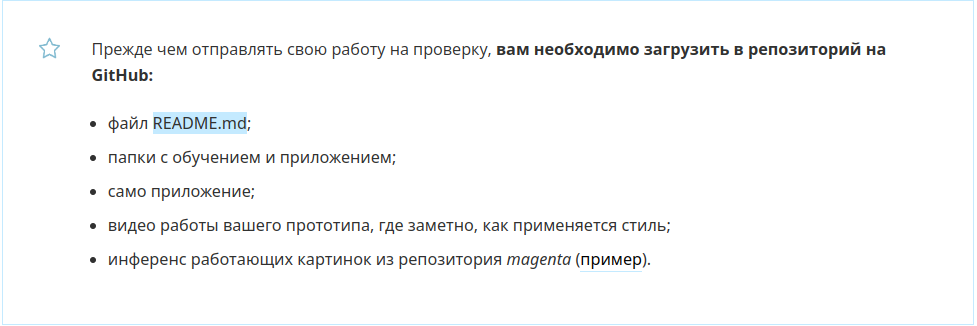
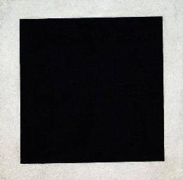

# Project 4. Style Transfer for a Mobile Device

  
   
  

## Contents
[Introduction](./README.md#Introduction) 
[Files](./README.md#Files) 
[Magenta Installation](./README.md#Magenta-Installation) 
[Model Training](./README.md#Model-Training) 
[Inference](./README.md#Inference) 
[Mobile Application](./README.md#Mobile-Application)

## Introduction

This Skillfactory project is basically consists of two stages: 
* implementing the [Magenta Arbitrary Image Stylization](https://github.com/magenta/magenta/tree/main/magenta/models/arbitrary_image_stylization) for model training using custom *style* images; 
* building an Android application with the same models based on the [TensorFlow Lite Style Transfer Demo](https://github.com/tensorflow/examples/tree/master/lite/examples/style_transfer/android). 

The above *Magenta* repository has an inactive status on GitHub, currently it seems impossible to launch it on Google Colab or Kaggle. I succeeded in launching the training sripts on a local machine with Debian 11 and trained a "one-style" model for the "cobwebbed" style from the [Descriptable Textures dataset](https://www.robots.ox.ac.uk/~vgg/data/dtd/) using part of ImageNet as content training images. But for further steps I used the ready-made models which are kindly provided in the below-mentioned repositories and are well trained by *Magenta* developers on decent 8 GPUs with the complete ImageNet and various style images. 

There is no any guarantee that nothing is going to fail if you try to repeat my steps as everything is strongly dependent on the hardware, operating system, etc., but I hope this description gives at least some ideas of how this project could be fulfilled.

:arrow_up: [to Contents](./README.md#Contents)

## Files

Useful files:

* [Google Colab notebook](ImageNet_Download.ipynb) to get ImageNet TFRecords from Goofle Storage and save them onto your Google Drive.

Files needed to pass the project:

* README.md is this file
* The "training folder" has a size of 40 GB, and the folder with Android Studio application project is of 1.5 GB. As there is no any reason to clog the cloud services, and especially GitHub, up to the limits with this unnecessary raw material, I made screeshots instead: 
  * [the training folder screenshot](figs/training_dir.png), the folder contains Tensor Board log files and the latest model checkpoints numerated according to training steps;
  * [the Tensor Board screenshot](figs/tensor_board.png) with some metrics obtained during the training;
  * [the screenshot of the folder with the Android Studio application project](figs/app_dir.png).
* [The Android application](https://disk.yandex.ru/d/PVhrz7pQTf1ZWw) with a size of about 410 Mb, built from the above mentioned Android Studio project, is uploaded to Yandex Disk. I will delete it after the project has been checked out by a Skillfactory mentor.
* [The video of the app working on an Android smartphone](https://disk.yandex.ru/i/ppqZmB2Z_JUrOA) is also uploaded to Yandex Disk.
* Inference images are in the [inference_figs/](inference_figs/) folder. See also the "Inference" section below. 

:arrow_up: [to Contents](./README.md#Contents)

## Magenta Installation

You have to use [Magenta Arbitrary Image Stylization Project](https://github.com/magenta/magenta/tree/main/magenta/models/arbitrary_image_stylization). The repository has now an inactive status on GitHub. The problem is that you are most probably going to be unsuccessfull in trying to launch it on Google Colab or Kaggle, even using the old [stunts](https://github.com/magenta/magenta/issues/2045). The only solution I saw was installing *Magenta* on my local machine.

* Whichever way of *Magenta* installation you use, it's better to do it in a separate *conda* environment (install [miniconda](https://docs.conda.io/projects/miniconda/en/latest/) if you haven't got one yet).
* Activate the conda environment and install *Magenta* as is described in [its repository](https://github.com/magenta/magenta/). The necessary TensorFlow library version will be installed along automatically.
* You are now able to launch the scripts for model inference and training as is described in the [Image Stylization Project](https://github.com/magenta/magenta/tree/main/magenta/models/arbitrary_image_stylization) (don't forget that your conda environment should be active). The necessary pretrained models can be found on the same web page.
* Probably, *Magenta* will use the CPU, not a GPU. Although you can start the training, creation of even a simple "one-style" model will cost you a day or more. So you may want to try the training with a GPU.
  * First of all, you need an NVIDIA GPU. The GPU must have a sufficient amount of memory to run the scripts! By personal experience, 4 GB was not enough. Also, an NVIDIA driver must be properly installed in your operating system (OS). By default, OSs install their own video drivers, which are not designed for machine learning libraries. Look up the driver for your OS on [the Nvidia website](https://www.nvidia.com/download/index.aspx). Notice that Linux distributions provide their own NVIDIA drivers in the distribution's native package management format. This may interact better with the rest of your distribution's framework, and you may want to use this rather than NVIDIA's official package. In my case (Debian 11) I istalled the driver using [this instruction](https://linuxhint.com/install-nvidia-drivers-debian-11/).
  * If everything above has been done, but the the scripts are still using the CPU instead of the GPU, this is because TensorFlow can't find necessary components in your system. In my case, I had to install additionally the [CUDA Toolkit](https://developer.nvidia.com/cuda-toolkit) and [cuDNN library](https://docs.nvidia.com/deeplearning/cudnn/index.html). Check out if you have the [NUMA error](https://gist.github.com/zrruziev/b93e1292bf2ee39284f834ec7397ee9f) and correct it if necessary. Also, see the messages the scripts print in the terminal, some hints may be found in there. 
  * ***WARNING!*** If *Magenta* has access to the GPU after these steps, it will use the GPU for the training; and if the memory of the GPU is insufficient to run the training script, it will just fail without re-directing the training to a CPU. Then, possibly, uninstallation of the above components could return *Magenta* to the CPU training (I didn't check it).

:arrow_up: [to Contents](./README.md#Contents)

## Model Training

The steps to perform different kinds of model training is well described in the [Image Stylization](https://github.com/magenta/magenta/tree/main/magenta/models/arbitrary_image_stylization) repository. You are free to use your own *style* images for the training, but the problem is that the scripts use special TFRecord ImageNet files as the *content* images, which you must have in disposal to launch the scripts. There is no way to use any other dataset for the *content* training.

TFRecord is a special TensorFlow format to save datasets, and these files have their unique {string: value} structure, so it is impossible to make a "fake ImageNet" dataset from some other photos, because we don't know the exact structure of the TFRecord files the sripts expect.

Of course, you can download the huge ImageNet (ILSVRC 2012) and make the TFRecord files necessary for *Magenta* using [this script](https://github.com/tensorflow/models/blob/master/research/slim/datasets/download_and_convert_imagenet.sh) (you'll also need to install the [TensorFlow-Slim image classification model library](https://github.com/tensorflow/models/tree/master/research/slim) beforehand). The raw data size of ImageNet is 300 GB, and the processed data size is 150 GB, so you'll need about 500 GB of free space to start with, not to mention the other hardware and the processing time. 

Fortunately, there is a way to get these TFRecord files from Google Storage using the [Google Colab notebook](ImageNet_Download.ipynb) presented here. The notebook gets to the cloud, read ImageNet TFRecords and save necessary files to your Google Drive. I downloaded 5 files (each containing many images) from the training set. You can correct the last cell in the notebook to get files by your choice.

That's it, you now can run the scripts using the [instructions](https://github.com/magenta/magenta/tree/main/magenta/models/arbitrary_image_stylization). The [the training log folder](figs/training_dir.png) on your local machine will contain the latest models the script constructs.

:arrow_up: [to Contents](./README.md#Contents)

## Inference

The inference with the identity interpolation technique using my one-style "cobwebbed" model. The first image is the *style* given to the model for the inference. 

  
   
  
  
  

Inference with the fully trained [model](https://storage.googleapis.com/download.magenta.tensorflow.org/models/arbitrary_style_transfer.tar.gz) from *Magenta* developers. Malevich's Black Square.

  
   
  
  
  

:arrow_up: [to Contents](./README.md#Contents)

## Mobile Application

* Install Android Studio (https://developer.android.com/studio/). During the installation process accept all suggestions of SDK/JDK downloading or other upgrading.

* Clone [TensorFlow Lite sample applications](https://github.com/tensorflow/examples/tree/master/lite) repository from GitHub:  
`git clone https://github.com/tensorflow/examples`

* Open the Android style transfer example project as is described [here](https://github.com/tensorflow/examples/tree/master/lite/examples/style_transfer/android). The android project you need is in the cloned repository: `examples/lite/examples/style_transfer/android`.

* DO NOT make any suggested upgrades after you have opened the project. I've got errors when building the app after such upgrading. The project seems to be obsolete and is not fully compatible with the changes. The errors can possibly be corrected easily if you are familiar with Android development, but I'm not.

* The models for the mobile application will be downloaded automatically. Optionally, you can replace them with your custom models that should be beforehand converted to TensorFlow Lite format according to [these instructions](https://github.com/magenta/magenta/tree/main/magenta/models/arbitrary_image_stylization#train-a-model-on-a-large-dataset-with-data-augmentation-to-run-on-mobile).

* Connect an Android smartphone to your computer. If you havn't got one or have difficulties in connecting it with the computer (yes, it's still can be a problem in Linux systems in the year 2023), [create an emulator](https://developer.android.com/studio/run/emulator) in Android Studio.

* Build the application (.apk file) using the Android Studio menu: Build -> Build Bundle(s) / APK(s) -> Build APK(s). A more detailed instruction can be found [here](https://developer.android.com/studio/run). Your .apk file will be on `examples/lite/examples/style_transfer/android/app/build/outputs/apk/debug/app-debug.apk`

* This .apk file can be uploaded/downloaded by any way to an Android device and installed there by opening the .apk file and permitting installation from .apk files (most Android devices will ask for necessary permissions automatically, otherwise make changes in the Android device settings, there are a lot of instructions on the Interenet).

* The default version of the application is pretty "heavy", over 400 MB. Optionally, you can modify it. The basics of Android development can be found, for example, [here](https://startandroid.ru/ru/uroki/vse-uroki-spiskom.html) (190 lessons, in Russian).

:arrow_up: [to Contents](./README.md#Contents)