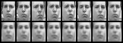

# Variational Autoencoder

### Project description
A simple variational autoencoder 

### The case    

* Reparameterization trick
* Reconstruction and Kullback–Leibler losses

### The data
Fray Face dataset
